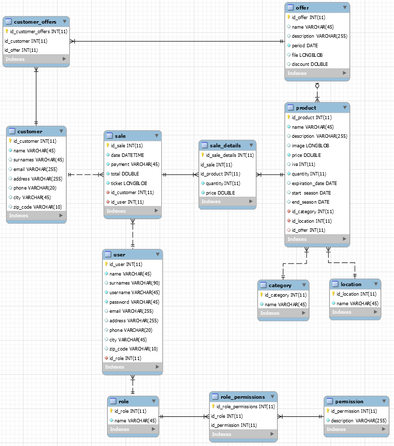

# Módulo Proyecto DAM

> *por Adrian Carmona*

---

## Traducciones

* [Español](./README.es.md)
* [Inglés](./README.md)

## Índice

- [Módulo Proyecto DAM](#módulo-proyecto-dam)
  - [Traducciones](#traducciones)
  - [Índice](#índice)
  - [Enunciado del proyecto](#enunciado-del-proyecto)
  - [Introducción](#introducción)
  - [Herramientas utilizadas](#herramientas-utilizadas)
  - [Base de datos](#base-de-datos)
    - [Esquema](#esquema)
  - [Estructura del proyecto](#estructura-del-proyecto)
    - [Organización de la aplicación](#organización-de-la-aplicación)
    - [Explicación de las clases](#explicación-de-las-clases)
    - [Interfaz gráfica](#interfaz-gráfica)
  - [Utilización del programa](#utilización-del-programa)
  - [Dificultades encontradas](#dificultades-encontradas)
  - [Ampliaciones](#ampliaciones)
  - [Conclusiones personales](#conclusiones-personales)

## Enunciado del proyecto

[Haga clic para abrir el documento](./Project%20Statement.pdf)

Un programa típico necesario en muchas micro-pymes es el TPV (Terminal de Punto de Venta) que se trata de un programa destinado a la venta de productos o servicios. Ejemplos de sitios donde podemos encontrar este tipo de programas son los bares, peluquerías, comercios en general.

Suelen ser programas que tienen varios apartados, pero el suele estar activo es de ventas, con la añadidura de tener una pantalla táctil que agilice el proceso. Como se ha dicho anteriormente podemos disponer de más módulos como la gestión de stocks, la gestión de pedidos, realizar campañas de promoción, etc.

La aplicación implementará la gestión de ventas:

  - Permitirá el cobro del servicio realizado.
  - El registro de las ventas de distintos productos.
  - También se permitirá la devolución del precio de un servicio o del producto vendido.
  - Emisión del ticket para el cliente
  
Para mejorar las ventas del kiosco, la aplicación permitirá una gestión de los clientes (altas, modificaciones y bajas) que incluirá la posibilidad de realizar campañas de marketing a través de canales como el correo electrónico.

  - Posibilidad de enviar ofertas a los clientes a través del correo
  - Las campañas de ofertas irán acompañadas de una imagen o fichero HTML que promocionará la oferta.

Otra de las cuestiones que deberá tratar el programa es la gestión del stock de productos que se venden en el kiosco.

  - Recepción de productos.
  - Salida de productos.
  - Control del stock

## Introducción
    
## Herramientas utilizadas

* MySQL
* Figma
* Visual Studio

## Base de datos

### Esquema

## Estructura del proyecto

### Organización de la aplicación

### Explicación de las clases

### Interfaz gráfica

## Utilización del programa

## Dificultades encontradas

## Ampliaciones

## Conclusiones personales
