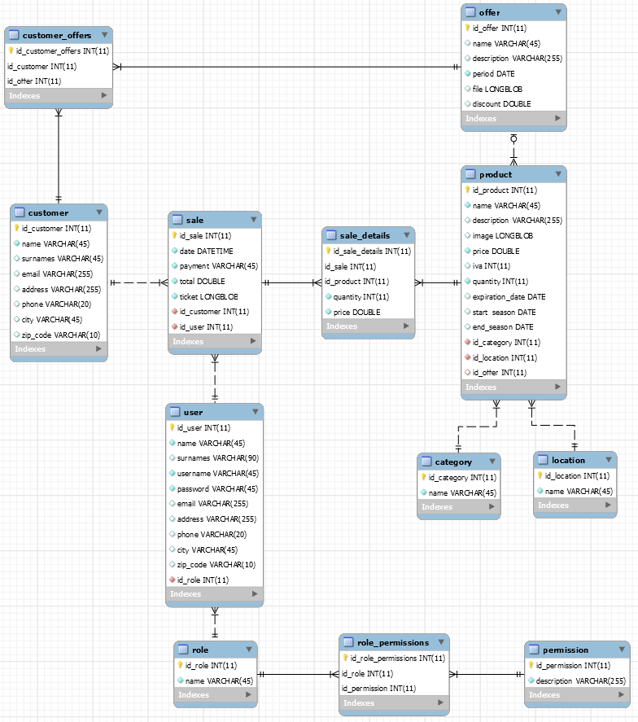

# Project Module DAM

> _by Adrian Carmona_

---

## Translations

- [English](./README.md)
- [Spanish](./README.es.md)

## Index

- [Project Module DAM](#project-module-dam)
  - [Translations](#translations)
  - [Index](#index)
  - [Project statement](#project-statement)
  - [Introduction](#introduction)
  - [Used tools](#used-tools)
  - [Database](#database)
    - [Schema](#schema)
  - [Project structure](#project-structure)
    - [Application organanization](#application-organanization)
    - [Explanation of the classes](#explanation-of-the-classes)
    - [Graphic interface](#graphic-interface)
  - [Use of the program](#use-of-the-program)
  - [Difficulties encountered](#difficulties-encountered)
  - [Extensions](#extensions)
  - [Personal conclusions](#personal-conclusions)

## Project statement

[Click to open document](./Project%20Statement.pdf)

A typical program needed in many micro-SMEs is the POS (Terminal Point of
Sale) that it is a program for the sale of products or services.
Examples of places where we can find this type of program are bars,
hairdressers, shops in general.

They are usually programs that have several sections, but the one that is usually active is of
sales, with the addition of having a touch screen that speeds up the process.
As previously said, we can have more modules such as the management of
stocks, order management, promotional campaigns, etc.

The application will implement sales management:

- It will allow the collection of the service performed.
- The registration of sales of different products.
- The return of the price of a service or product will also be allowed sold.
- Issuance of the ticket for the client

To improve kiosk sales, the application will allow customer management (registrations, modifications and cancellations) that will include the possibility of carrying out marketing campaigns through channels such as email.

- Possibility of sending offers to customers through the mail
- The offer campaigns will be accompanied by an image or HTML file that will advertise the offer.

Another of the issues that the program must deal with is the management of the stock of products that are sold in the kiosk.

- Product receipt.
- Output of products.
- Stock control

## Introduction

## Used tools

- MySQL
- Figma
- Visual Studio

## Database

### Schema

## Project structure

### Application organanization

### Explanation of the classes

### Graphic interface

## Use of the program

## Difficulties encountered

## Extensions

## Personal conclusions
